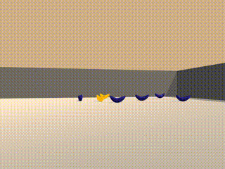
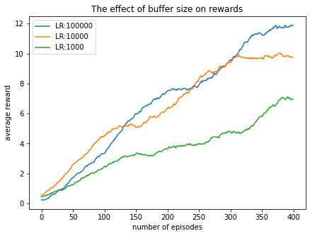

# Project  Report

In this project, the Deep Q-Networks algorithm is implemented to train an agent for navigating itself. The below figure shows the outcome of this project via using the graphics. The agent before training is seen in the left side, and the trained one is in the right side.

Random Banana Agent         |  DQN Banana Agent 
:-------------------------:|:-------------------------:
  |  

### Environment
Unity's ML Agents package is utilized in the project to train the agent on the environment named Banana. In this environment, yellow and blue bananas are randomly placed on the platform. Moreover, position of the agent is also randomly determined. This agent perceives a 37-dimensional vector as its own state. Velocity and the ray-based observations are kept in the state.

### Methodology
The Deep Q-Networks is an algorithm in which it is trained to find out the optimum Q values. It can bee too complex depending on a task. In this project, we keep it simple since our environment provides us state values in 37-dimensional space. Moreover, one may use the pixels in the enviroment as the input state. Due to simplicity of the input state, we prefer to use CPU in order to train our agent.

### Results
We used the hyperparameters as the following:
  - BUFFER_SIZE = int(1e5)  # replay buffer size
  - BATCH_SIZE = 512        # minibatch size
  - GAMMA = 0.99            # discount factor
  - TAU = 1e-3              # for soft update of target parameters
  - LR = 5e-4               # learning rate 
  - UPDATE_EVERY = 4        # how often to update the network
  
Our agent is capable of solving the task after the episode 508. The result of the DQN algorithm is the following:  
  > Episode 100	Average Score: 0.71  
  Episode 200	Average Score: 3.65  
  Episode 300	Average Score: 6.74  
  Episode 400	Average Score: 10.03  
  Episode 500	Average Score: 11.95  
  Episode 600	Average Score: 12.55  
  Episode 608	Average Score: 13.02  
  Environment solved in 508 episodes!	Average Score: 13.02   
  
The average score value is calculated by averaging scores in the last 100 episodes.

#### The learning rate effect
A learning rate value can vary depending on what kind of task the algorithm is train on. Therefore, different values are selected for the learning rate to see how it behaves during training. We set the maximum number of episodes to 500 since our aim is to see the effect of it. When we observe the following figure, we see that smaller learning rates are better for learning in this task. 

#### The buffer size effect
Apart from the learning rate value, buffer size can also play an important role for learning. Therefore, an experiment is conducted to see whether or not is it important. We set the maximum number of episodes to 500 since our aim is to see the effect of it.

As you can see in the above figure, decreasing the buffer size value leads to a worse performance in learning. Therefore, it can be said that if you have enough memory, then you should probably set the buffer size to a higher values.

### Conclusion
Using Pytorch and Unity's ml-agents in this project is quite impressive. As an extension of the work done in the project, grid search can be applied to find the optimum hyperparameters.

